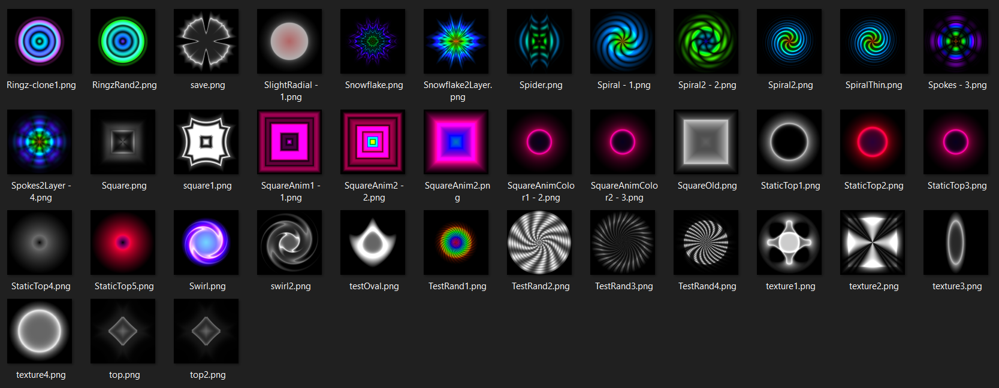
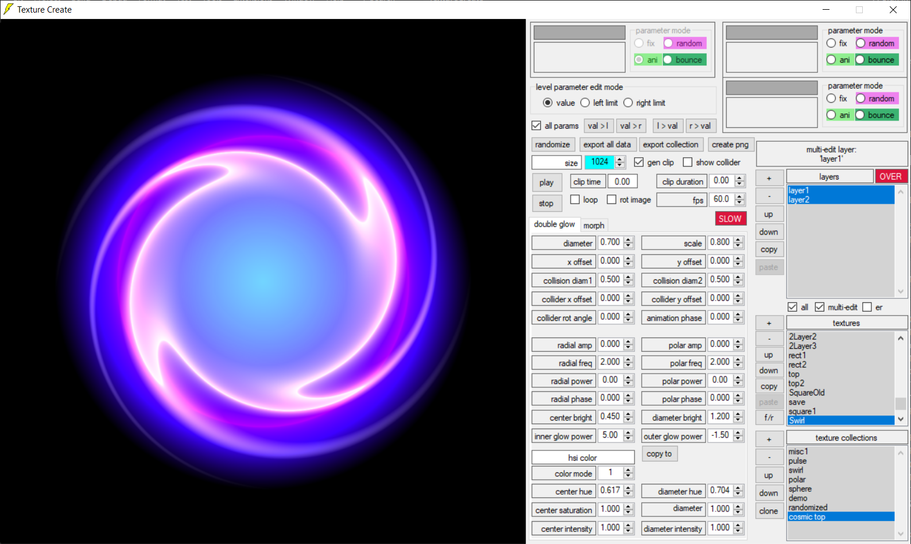
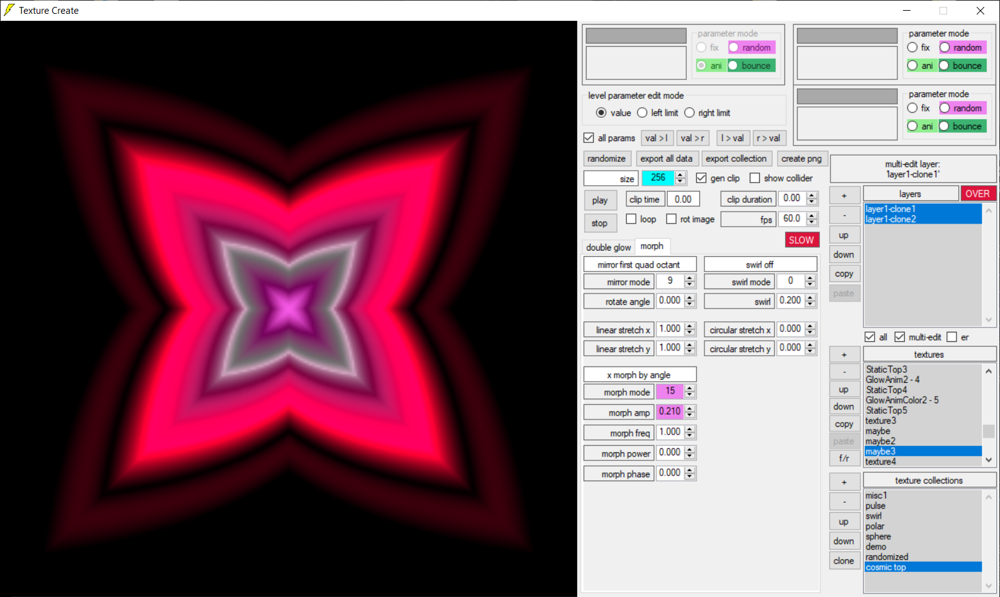
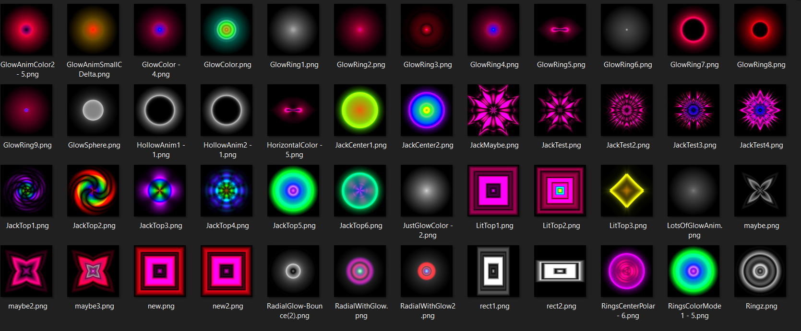

# ***Texture Create***

***Texture Create*** is an in-house developer tool I wrote in Visual Studio's C# for creating textures and texture array animations.  Its primary output, in the form of `.dat` texture description binaries, and its image generation algorithms are utilized in **Cool Bear Studios'** apps that are currently released and still under development.  It evolved from simple parameterized functions I coded for ***Cosmic Top*** to draw circles with inner and outer glow, i.e., double glow circles, which have the appearance of glowing spheres.

These double glow circles and similar glow rectangles became the foundational primitives of ***Texture Create***.  Morphing these objects with angular swirl, linear stretching, mirroring and transforming them with scaling, translation offsets, rotations, color variations, and then adding them up in layers, allows a user to create a variety of cool looking textures.

Since all the textures are mathematically defined by a finite set of parameters, limits can be set for any given parameter which can either be randomized to create a family of textures with a variation on a theme or time varied between the limits to create animations.

Although one can use ***Texture Create*** to create individual `.png` images as assets directly, it's primary output, once again, is in the form of `.dat` texture and texture array animation description binaries which are decoded in our apps to generate the asset images either on the fly or at the start of a level.  Despite being able to create and view animations, currently there is no feature to output an animation file directly.

## Features
* Create texture and texture array animations stored and retrieved in `texture create collections` or `.tcc` files
* Export texture and texture array animation descriptions to other apps in the form of `.dat` binary files
* Create, view and save `.png` images directly
* Create, view but not able to save animations files directly
* Evolved from parameterized functions of glowing circles for ***Cosmic Top***
* All textures mathematically defined by a set of parameters specifying morphs and transformations of these glow circles
* Parameter limits can be defined to create randomized images with a theme or animations
* Written in C# and built in Visual Studio 2026

In order to build and run the solution, a machine running Windows 10 or 11 is advised with a recent version of Visual Studio installed.

## Building
1. Open Visual Studio and click `Clone a repository` from the side menu or from the `Git` menu
2. Enter `https://github.com/jabbeyspace/TextureCreate.git` for the repository location
3. Select a path to an empty folder to save it to and click the `Clone` button
4. Wait for the repository to finish downloading and for Visual Studio to open the `TextureCreate.sln' automatically
4. Go to the `Build` menu and select `Build Solution` or press `Ctrl + Shift + B`

A new `bin` folder and a .NET subfolder such as `net35` should now contain `TextureCreate.exe` within the path specified above.  Accompanying the `.exe` file will be a `tc collections` folder containing a sample texture create collection file named `cosmictop.tcc`.  All the texture images presented are defined by this `.tcc` file.  If you make changes to these textures, you can always restore the sample `.tcc` file simply by going to the `Build` menu and selecting `Rebuild Solution`.

## Running
1. In Visual Studio, go to the `Debug` menu and select `Start Debugging` or press `F5` to run or
1. Outside Visual Studio, navigate to the `TextureCreate.exe` file and double-click it to run
2. Click on a texture named in the `texture` list box to make it the active texture
3. Click on the `edit box` next to a parameter name to make that the current editing parameter 
4. To add a new texture, click the `+` button next to the `textures` list box
5. To add a new texture collection, click the `+` button next to the `texture collections` list box
7. Click the `create png` button to save the currently active texture as a `.png` file

No further instructions are provided here, so please experiment, learn how it works, and enjoy!

